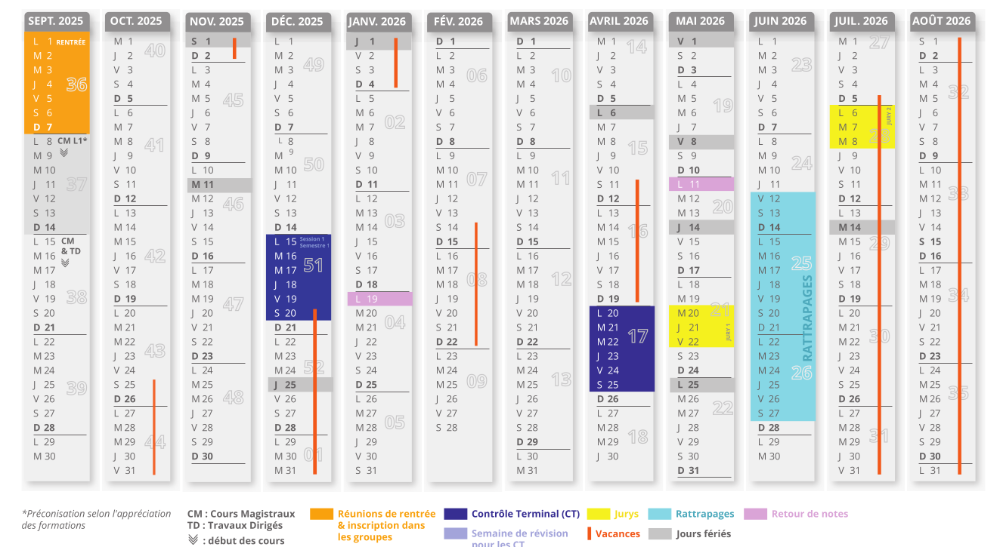

## Actualités




  

    {{ actu.header }}
    Publié le {{ actu.date | date: "%d/%m/%Y" }} 
  

  

    <h4 class="card-title">{{ actu.title }}</h4>
    
{{ actu.content | markdownify }}

  



<a class="btn btn-outline-info btn-lg m-5" href="actualites.html">Voir toutes les actualités</a>

## Formations en Traitement Automatique des Langues (TAL) de l’Université Marie et Louis Pasteur

  Le département Traitement Automatique des Langues (TAL) assure les formations en : 
  
<h4> 
  <a class="btn btn-outline-primary btn-lg mx-5" href="master.html">Master LLCER parcours TAL</a>
  <a class="btn btn-outline-primary btn-lg mx-5" href="licence.html">Licence parcours TAL</a>
</h4>

## Calendrier universitaire 2025-2026

